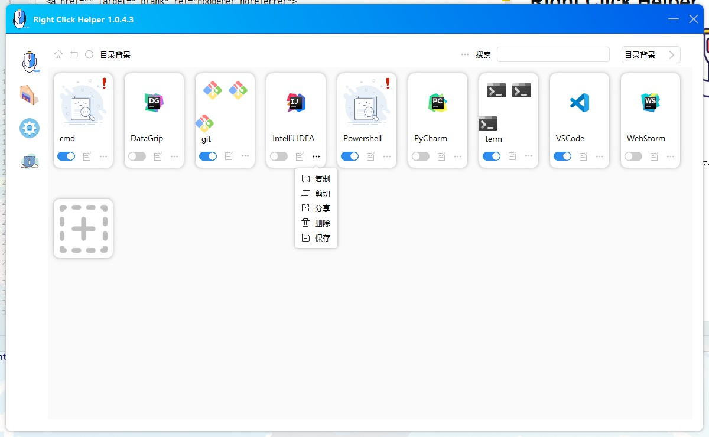
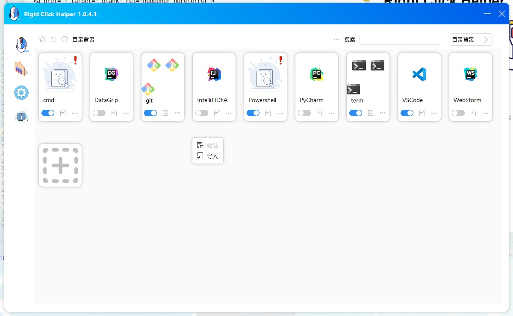

# Right Click Helper
<p align="center">
  <a href="" target="_blank" rel="noopener noreferrer">
    
  </a>
</p>

## 介绍
由python pyqt模块开发的一款windows环境下卡片化右键菜单选项管理工具

## 功能点
* [x] 巨好看的UI
* [x] 卡片化的管理右键菜单项
* [ ] 拖拽的方式管理右键菜单
* [ ] 备份当前配置，并分享

## 预览图






## 再开发指导
* 创建虚拟环境[ps: **python == 3.9**]
  ```shell script
  # 如果全局没有安装过virtualenv，执行下面这条指令
  pip install virtualenv
  # 创建名为venv的虚拟环境
  virtualenv venv
  # 激活虚拟环境
  .\venv\Scripts\activate.bat
  # 安装项目依赖
  pip install -r requirements.txt -i http://mirrors.aliyun.com/pypi/simple/
  ```
