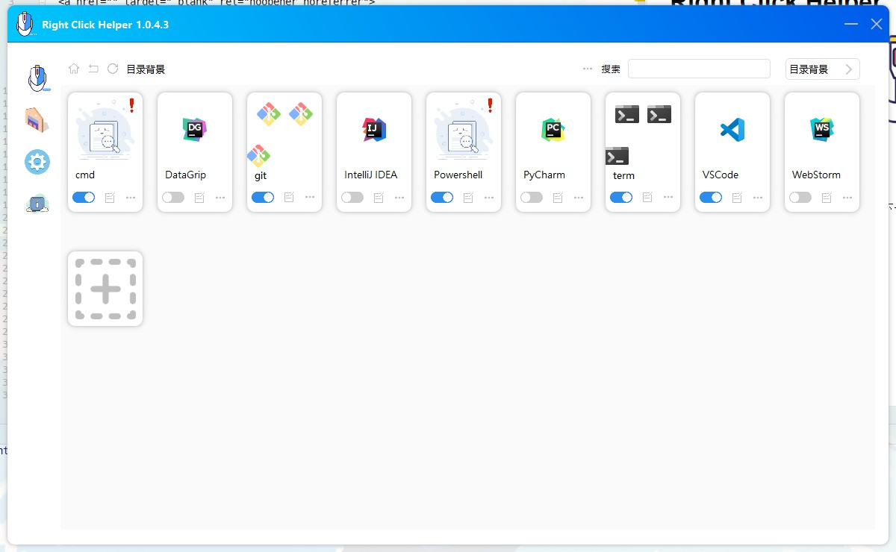
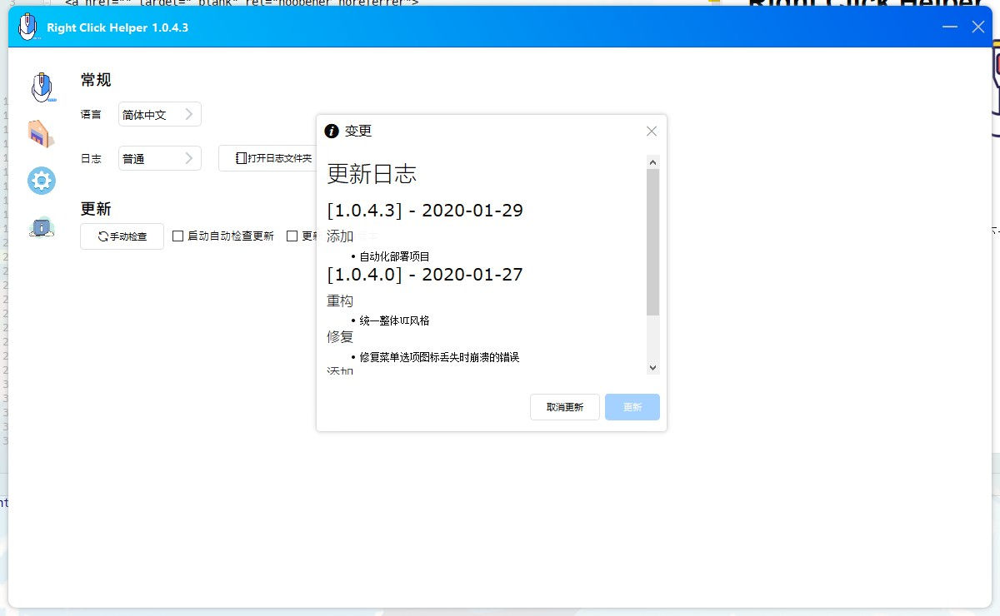

# Right Click Helper
<p align="center">
  <a href="" target="_blank" rel="noopener noreferrer">
    
  </a>
</p>

## 介绍
由python pyqt模块开发的一款windows环境下卡片化右键菜单选项管理工具

## 功能点
* [x] 巨好看的UI
* [x] 卡片化的管理右键菜单项
* [ ] 拖拽的方式管理右键菜单
* [x] 备份当前配置，并分享
* [x] 自动检测更新

## 预览图







## 再开发指导
* 创建虚拟环境[ps: **python == 3.9**]

  ```shell script
  poetry install
  ```

* 切换本地默认提交分支 `git branch --set-upstream-to=origin/dev master`
